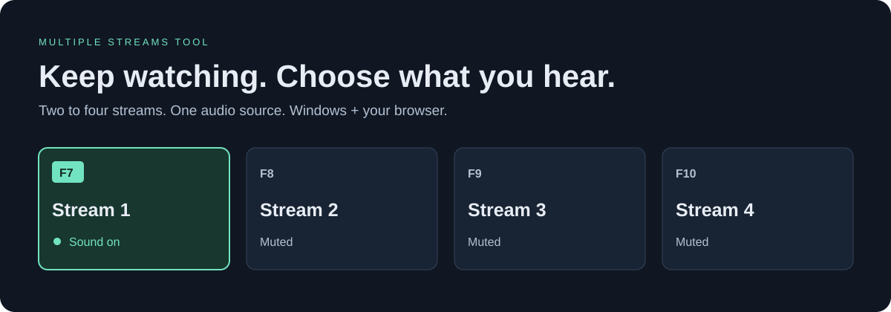
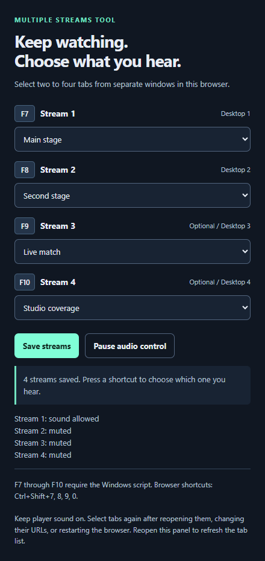

# Multiple Streams Tool



Watch several streams at once. Press a key to bring one forward and hear its audio while the other selected tabs stay muted.

Use it for games, live events, conference stages, or any other browser streams. It works with **two to four streams in separate browser windows**. Each shortcut sets the audio state explicitly, so pressing the same key twice keeps the same stream audible.

[Download the latest release](../../releases/latest) · [Report a bug](../../issues) · [MIT license](LICENSE)

## What you need

- **Windows 11** for virtual desktop switching.
- One browser profile containing all your stream windows. Use Comet, Chrome, or Edge. The original two-stream workflow was tested with Comet; the public four-stream controller and setup panel were tested in isolated Chromium. Chrome and Edge desktop workflows still need manual verification.
- **[AutoHotkey v2](https://www.autohotkey.com/)** for F7 through F10. Version 1 will not work.

The extension controls audio by tab, even when all streams share a browser process. It leaves your computer's master volume and unrelated tabs alone. The tool does not supply streams, bypass sign-ins, or change playback restrictions.

## Set it up once

### 1. Download and install the browser extension

Download the ZIP from [Releases](../../releases/latest), extract it, and keep the folder somewhere permanent. Moving or deleting it will break the unpacked extension.

Open your browser's extensions page:

| Browser | Address to paste into the address bar |
| --- | --- |
| Chrome | `chrome://extensions` |
| Edge | `edge://extensions` |
| Comet | `chrome://extensions` |

Turn on **Developer mode**, choose **Load unpacked**, and select the `extension` folder inside the extracted project. Pin **Multiple Streams Tool** from the browser's Extensions menu so it is easy to find.

This is a manually loaded extension, not a Chrome Web Store listing. A browser managed by your employer or school may block this installation method.

### 2. Check its keyboard shortcuts

Open the extensions page's **Keyboard shortcuts** section. In Chrome and Comet, you can paste `chrome://extensions/shortcuts`; in Edge, use `edge://extensions/shortcuts`.

Set these shortcuts to **Global**:

| Extension command | Browser shortcut | Windows shortcut | Windows desktop |
| --- | --- | --- | --- |
| Select stream 1 | Ctrl+Shift+7 | F7 | Desktop 1 |
| Select stream 2 | Ctrl+Shift+8 | F8 | Desktop 2 |
| Select stream 3 | Ctrl+Shift+9 | F9 | Desktop 3 |
| Select stream 4 | Ctrl+Shift+0 | F10 | Desktop 4 |

You only need to configure the streams you will use. The setup panel checks their key combinations when you save. You must check the Global scope yourself because the browser API does not report it.

Use the extension in only one browser/profile at a time. Another extension or application using these shortcuts can prevent them from reaching this tool.

### 3. Install AutoHotkey v2

Install v2 from the [official AutoHotkey site](https://www.autohotkey.com/). Then double-click **Start Stream Switcher.cmd** in the extracted folder. A green H icon appears in the Windows notification area while the script runs.

The launcher checks the usual per-user and system installation folders. If you installed AutoHotkey somewhere else, open `Multiple-Streams.ahk` with AutoHotkey v2 directly.

The script does not add itself to Windows startup or change system settings.

## Each time you watch

1. Open your streams in **separate windows of the same browser profile**. Start playback and leave each player's own sound enabled.
2. Press **Win+Tab** to open Windows Task View. Create the desktops you need and drag stream 1's window to Desktop 1, stream 2's to Desktop 2, and so on. Use the desktop order from left to right, regardless of their names.
3. Open **Multiple Streams Tool** from the browser toolbar. Choose the stream tabs in order and click **Save streams**. Leave streams 3 and 4 blank if you only need two. Saving alone does not mute anything.
4. Start **Start Stream Switcher.cmd** if it is not already running. Put each player in fullscreen if you want it, then press **F7**, **F8**, **F9**, or **F10** to watch and hear that stream.

The shortcuts preserve fullscreen. Both selected and muted streams can keep playing, subject to the streaming site's background playback behavior.

After reopening a tab, changing its URL, restarting the browser, or reloading the extension, select your tabs and save again. Reopen the extension panel to refresh its list of available tabs.

<details>
<summary>See the setup panel</summary>



This screenshot uses local dummy pages, not real stream URLs or browsing history.

</details>

## Use it without virtual desktops

Keep the windows on the same desktop and use **Ctrl+Shift+7 / 8 / 9 / 0** directly. The extension focuses the selected window and sets its audio state. You do not need AutoHotkey for this mode.

The public release targets Windows. Other operating systems and Firefox have not been validated.

## Stop or remove it

Right-click the green H icon in the Windows notification area and choose **Stop stream switcher** to release F7 through F10. The browser extension's shortcuts remain registered while it is enabled.

**Pause audio control** in the extension prevents further audio changes. It does not stop the Windows script or unmute tabs. Audio stays in its last state; you can unmute tabs through the browser's tab menu.

To remove the tool, stop the script, remove the extension from your browser, then delete the extracted folder. It creates no startup task or background service.

## If something does not work

| Symptom | What to check |
| --- | --- |
| F7 does nothing | Start the script. On some laptops, use Fn+F7. Check that AutoHotkey v2 is installed. |
| The desktop changes but the audio does not | Save the tabs again. Check the extension's error badge and ensure the browser shortcuts are Global. |
| The wrong desktop appears | Put the windows on the numbered desktops in the table. The tool does not move windows or discover their desktop assignments. |
| The selected stream is silent | Turn up the video player's volume, unmute the player itself, and check Windows output volume. Tab unmuting cannot fix a paused or internally muted player. |
| A stream is missing from the list | Open it in a regular HTTP/HTTPS tab in the same profile, then reopen the panel. Private browsing is not supported. |
| A stream closes or navigates elsewhere | Select its replacement and save again. An unavailable target leaves audio unchanged; an unavailable other stream is skipped. A navigated tab is no longer controlled. |
| Playback stops in the background | Check your browser's sleeping-tab settings and the streaming site's restrictions. The tool changes mute state, not playback policy. |
| A shortcut conflicts with another app | Stop the script to release F7 through F10. Disable the extension to release its browser shortcuts. |

Windows desktop switching and browser audio control happen in sequence. If the extension is unavailable, the desktop may still change. An unused F9/F10 can also move to an existing desktop before the extension reports that no stream is assigned. The script reserves all four function keys while running.

Windows keeps its normal desktop animation. Switching is quick, but not zero-delay. Desktop detection reads Explorer's virtual desktop registry values, which are not a stable public Windows API and may change in a Windows update.

## Privacy

The extension requests only `tabs` and `storage`:

- `tabs` lets it list tab titles and URLs, select a tab, and set its mute state.
- `storage.session` holds selected tab IDs, URLs, and status messages for the current browser session. It does not sync them to an account.

There are no analytics, network requests, content scripts, host permissions, native messaging hosts, or telemetry in the tool. Stream websites still make their own normal network requests. The Windows script reads desktop identifiers and sends keyboard shortcuts; it does not read page content or browser profiles.

The [tabs](https://developer.chrome.com/docs/extensions/reference/api/tabs), [commands](https://developer.chrome.com/docs/extensions/reference/api/commands), and [storage](https://developer.chrome.com/docs/extensions/reference/api/storage) documentation describes the browser APIs used here.

## Development and testing

The extension is plain JavaScript and CSS. It has no build step or runtime package dependencies. With Node.js 20 or newer:

```sh
node test.mjs
```

These tests cover two to four streams, repeated and queued switches, mute ordering, fullscreen preservation, missing or changed tabs, rollback after errors, setup validation, pausing, and matching keyboard mappings. GitHub Actions runs the same tests on pushes and pull requests.

The Windows script also has a self-test. Run it with AutoHotkey v2:

```powershell
& "$env:LocalAppData\Programs\AutoHotkey\v2\AutoHotkey64.exe" /ErrorStdOut .\Multiple-Streams.ahk --self-test
```

Adjust the executable path for a system or custom installation. The self-test checks desktop parsing without registering hotkeys or switching desktops.

The public extension passed a separate test in a clean Chromium profile using four local dummy pages: loading, saving, pausing, repeated selections, actual tab mute states, and closed-tab recovery. These tests do not establish physical speaker output or global shortcut delivery. The earlier two-stream implementation was manually checked on Windows 11 with Comet, including actual player fullscreen and native desktop shortcuts. Four-stream Windows operation has not had the same manual test.

For a manual check, open streams in separate windows, select each shortcut twice, and alternate between them. Confirm that only the selected stream is audible and fullscreen stays on. Then close one stream and check the error message and recovery. Use ordinary Win+Ctrl+Left/Right between checks to confirm normal desktop navigation still works.

Bug reports should include your browser and Windows versions, the shortcut pressed, and what happened. Remove private URLs, account names, and unrelated tabs from screenshots or logs. Pull requests are welcome; run `node test.mjs` before sending one.

## License

[MIT](LICENSE). You can use, modify, and share the tool under that license.
